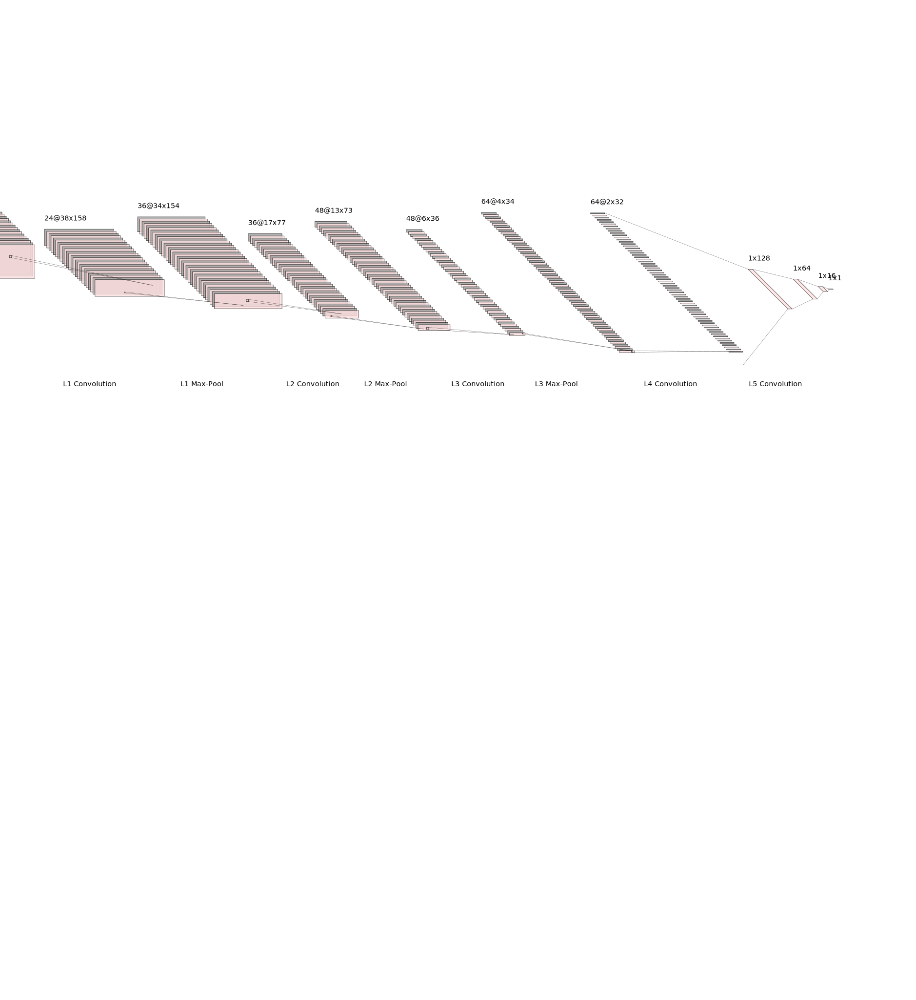

# SDC Behavioural Cloning Project

## Aim
The goal of the Behavioual Cloning Project was to navigate a simulated vehicle  around a test track by using a  Convolutional Neural Network to predict steering angles.

## Solution Files
My solution to this project consists of the following source code files that are needed to develop the model:

 - [train.py](train.py): Contains code for the training of a CNN using
 - a CSV file of the steering angles, throttled image files from centre,
   left and right vehicle cameras.  This program takes arguments to control the training of the model.
  - [nvidia.py](models/nvidia.py): This contains the code implementing the model used to predict the steering angles.  It is called NVIDIA as the model is based upon the research NVIDIA did for using deep learning to control a self driving car (see their Aug 2016 blog article [End-to-End Deep Learning for Self-Driving Cars](https://devblogs.nvidia.com/deep-learning-self-driving-cars/).
  - [datagen.py](models/generator.py): Contains the code for my data generator class [ImageGenerator()](/utils/datagen.py#L12-L111) that implements the file selection, reading from disk and image augmentation of the training images.
  - [drive.py](drive.py): If the Udacity provided utility for loading the trained model and interfacing it with the Udacity Car Simulator.  The final version is largely unmodified from that provided apart form setting the speed form 9 to 25.

Additional files of interest which are aviailable are the:
- [logs/train_20190317-170803.log](logs/train_20190317-170803.log): A log of the runtime training session.
- [trained/nvidia_20190317-170803.h5](trained/nvidia_20190317-170803.h5): the resultant model that successfully predicts steering angles for Track 1 of the car simulator.  This can be downloaded and used with the Udacity car simulator to drive the vehicle around Track 1 with the _drive.py_ program (ie `python drive.py trained/nvidia_20190317-170803.h5`).

### Running the Model
The model can be run to navigate the vehicle around the Udacity Car simulator Track 1 simply upon the following command:
```python drive.py trained/nvidia_20190317-170803.h5
```
The development environment the model was developed in was an Ubuntu 18.04 host loaded with:
- _Python 3.6._ 
- _Tensorflow r1.13_ compiled for GPU with NIVIDIA CUDA 10.0
- _Keras 2.2.4_
The model is saved in HDF5 format using _h5py version 2.9.0_


## Model Architecture and Training Strategy
### Model Architecture Overview
The final model selected is based upon the NVIDIA End-to-End Deep Learning for Self-Driving Cars](https://devblogs.nvidia.com/deep-learning-self-driving-cars/) research/demonstration paper. 

My implementation of the model is in the source file [nvidia.py](models/nvidia.py) has _5 Convolution Layers_ and _3 Fully Connected Layers_. Additionally embedded in the model [input  layers](#L27-33) apply pre-procesing to the RGB input images of dimensions 160 _high_ x 320 _wide_ :
 1. a __colourspace conversion__ layer changing RGB color space to YUV (160,320)
 2. a __normalisation layer__ to scale the images values in the range of [-1, 1]; 
 3. a __cropping layer__ to crop the input images to  a region interest of the road that excludes the Horizon and bonnet of the car.

A diagrammatic representation of the model architecture is shown below.  This has been illustrated using[NN-SVG](http://alexlenail.me/NN-SVG/index.html).



 I verified the architecture of the designed vs actual model implementation conducted with Tensorboard to view the graph. I utilised in training a Keras callback to Tensorboard, see [train.py](train.py#L148), to logging the training and validation loss as well as store a copy of the [neural network architecture graph](doc/architecture_graph.png).   This verification I found invaluable in the 'Traffic Signs Classifier' project where I used the resultant graph visualised in Tensorboard to identify I incorrectly implemented a layer due to a silly typo, hence I have made it standard practice to visualise the actual implementation vs desired deigned implementation.

Each training run also writes out a summary the model architecture as text See [logs/20190317-130803.log#L68-L134] lines 68-134 by using the Keras command [`model.summary()`](train.py#L142). 

The convolution layers reduce the cropped YUV image from __80x160@3__ input to a __2x32@64__ filter output with each layer progressively increasing in depth capturing different features.
 
The first [three convolution layers](train#L35-53) use the same layout of:
 1. __5x5 filter sizes__  moving across the filter slices with a __2x2 stride__
 2. Non linear __ELU Activation Function__ 
 3. __2x2 Max Pooling Layer__
 4. __Batch Normalizaion__ regularization function
 
 The next [two convolution layers](train.py#L66-74) use the same layout of:
 1. __3x3 filter sizes__  moving across the filter slices with a __1x1 stride__
 2. Non linear __ELU Activation Function__ 
 3. __Batch Normalizaion__ regularization function
 
 The output of the convolution layer is flattened to a __1x4096__ and fed into __3 x Fully Connected Layers__. Again each layer progressively reduces the output from the flattened __4096__ output of the convolution filter layer to a fully connected __128 > 64 > 16 > 1__ single value decimal output for the steering angle. 

### Over-fitting and Regularisation Considerations
 I added to the model regularisation in the forms of Batch Normalisation and Dropout to aid the models ability to produce 'alternate representations', generalisation and reduce over fitting.  My method of applying regularisation was to use "Batch Normalisation" in in the _Convolution Layers_ after non-linear activation and Max Pooling, whilst in Fully Connected Layers. Dropout was set to a 50% keep rate. The dropout rate greatly affected the number or training iterations required going form a consistent 8 epochs to requiring 30+ epochs. 

### Model Parameter Tuning
The model didn't need a lot of parameter tuning as the chosen optimised in the implementation was the [Adam Optimiser](train#L126) . The main considerations were were the **initial learning rate** which was chosen to be **0.0002**. This was established though several runs as higher values in the order of _1e-2_ and _1e-3_ would cause a high rate of drop in the loss, though there were clear periodic  oscillation around a minima. Choosing a smaller learning rate in the order of _1e-4_ meant mode epochs were required for the loss to decrease to an asymptote plateau, though the validation loss was more. The learning rate was easily changed through a command line parameter `--learn_rate 0.0002` being passed to `train.py` I also included a callback to a learning rate scheduler to force the decrease of the learning rate by half to a limit of _1e-5_ when there was no change in the loss.  The feature of the Adam optimiser, Ternsorboard callback to view losses and the learning rate scheduler reduced the need to perform the number of runs to the the model parameters. 

### Training Data
The training data utilised to train the model was the sample Udcaity data provided with the project that provided **8036  steering angles with camera views** of _centre, left and right camera_. **I augmented this data** by recording additional data from the simulator by:
- Driving around the track in reverse recording an additional **4292 steering angles with camera views**. The strategy behind driving reverse around the track was to provide additional steering angle data to aid in creating a balanced data set where there is not a bias to turning left or right.
- Short recovery driving session to record recovery angles where the car would drive off the track unless there was a steering correction input.  This was done around several points on the track where there were different surface transitions on the edge (eg, road -> read-white chicane, road -> ripple strip, road -> lines, road -> dirt) where the steering angles for correction were established and then the recording for the recovery made.  This added an additional **1259 steering angles with camera views**.
-   
Thus the data set used for training and validation totalled **13587 steering angles**

## Training Strategy

**Initial Models**
My model development and training strategy was iterative. I initially built basic models like what was illustrated in the lectures like
- [simple.py](models/simple.py) : A model where the cropped RGB images were flattened and fed into a Dense output layer 
- [lenet.py](models/lenet.py): A simple LeNet style model with 2 x Convolution followed by 2 x Fully Connected layers eith RELU activation.

These models formed the basis for developing the [train.py](train.py) training harness  where the python library _argparse_ was used to set default and enable variation in the training modes (eg dropout, early stopping, left right camera offset correction, multi=processing).

**Data Generator**
What was evident in these early stages of development was that my initial _data generator_ based on a python _loop_ with _yeild()_ was inefficient as there was  low GPU utilisation and training times per epoch were in the order of minutes for  such a small data set.  I profiled the GPU code with (NVIDIA Visual Profiler)[https://developer.nvidia.com/nvidia-visual-profiler] which showed that there were large pauses in the GPU operating the the code waiting on _thread locks_ when the keras [fit_generator()](train.py#L169-176) function was used with multiprocessing workers.  My loop generator was decorated with an [@threadsafe_generator\(\)](utils/generator.py#L18) to synchronise access to the generator. unfortunately it seems that the side effect was it stalled the worker threads from loading and preprocessing images from the disk.

I progressed to developing a new generator _class_ called [ImageGenerator(...)](utils/datagen.py#L12) which extended the [keras.util.Sequence](https://keras.io/utils/).  The Keras Sequence class is a utility class that can be used  to guaranteeseach sample per epoch will only be trained once.  My **ImageGenrerator(Keras.util.Sequence)**  class also had these effect benefit of keeping the code clean and functionality encapsulated. 

** Early Results**
The result the simple models were a surpirse. Initially the car would startonthe track and begin navigating, thought the car would not negotiate corners well and at times drive off the track even in straight sections.  The steering was also erratic at times, seemingly fixating on a track feature.  Adding dropout to the [LeNet](model/letnet.py) like model Fully Connected layers smoothed the steering significantly. It was clear that dropout  generating the steering angel, though the vehicle would still drive off the track. My thoughts about this were that the model doesn't have the _capacity_ to recognise the required features of the road and the road edges in order to steer appropriately nor to create 'redundant representations' to generalize the detection of the road.

** Final Model **
With the trail of though of having the need to create a _higher-capcity_ model to learn more features, I progressed implementing 5 Convolutional Layer, 3 Fully connected layer network based upon the work done by NVIDIA. The number of filters per layer mimicked that presented in the [End-to-End Deep Learning for Self-Driving Cars](https://devblogs.nvidia.com/deep-learning-self-driving-cars/) research paper, though my model differs in the size of the cropped input image being 80x320 instead of 66x200 as that being used in the NVIDIA's implementation. My process with developing the model went as follows:
1. Get the vehicle driving around the track first with just the convolutional layers first, no regularisation.
2. Add regularisation with Batch-Norm and Dropout and to generalise and prevent overfitting.

My implementation of the NVIDIA inspired model with Batch-Norm and Dropout was completely capable of driving around the track.  There were sections where the network agent seemed to want to avoid shadows, though I came up with a strategy to combat this which is discussed in my next section "Mechanics of Training".

Of note, my image size is larger than that used in the NVIDIA model, there is highly likely to be an exceess in the number of parameters in my network that that required to navigate the one type of track.  Essentially I really want the Convolution layers to recognise thread edges on the track and for the fully connected layers to set weights to create the steering inputs.

**TODO: Building the data sets**

## Mechanics of Training
All of the source code used for training is detailed in [train.py](train.py).  As mentioned above, I used several sources of data:
- The original Udacity Provided Data.
- My recorded data set of traversing the track in the reverse direction.
- My recorded data set of Recovery Driving with steering inputs to re-center the vehicle on the track.

In the early stages of development, to facitlitate loading of the data I created a [load_data()](train.py#L32-98) function that would glob the data directory (as specified with the *--datadir* argument) for the file *driving_log.csv* file that recorded the location of the file images as well as the throttle levels and steering angles.  The data was stored in delimited CSV.  The function [load_data()](train.py#L32-98) performed the following functions:
- **Loading the CSV** data into a pandas data frame using appropriate addressable column names.
- **Fixing file name paths** of all of the files to the correct relative path.
- **Smothing Steering Data** with an exponential weighted moving filter (see [DataFrame.ewm()](https://pandas.pydata.org/pandas-docs/stable/reference/api/pandas.DataFrame.ewm.html)) from the pandas library. The exception to this rule was the recovery data set there were only short consecutive recordings where I didn't the initial abrupt evasive angle smoothed out.  Upon reflection, this step is probably not necessary with drop-out regularisation added in the fully connected layers as this will smooth out the steering as was seen in the early sates of the simple LeNet model when drop-out was added.
- **Binning Steering Data** by cutting and sorting the data into steering angle 'bins' based upon the steering angle in radians. The bins were fine grained by 0.1 radian around the majority 0 degree angle up to 0.5 radians. Coarser bins were 0.5 to 0.75 radians and 0.75 to 1 radians.  Thus the complete list of bins were an array as such:
`array([-1.  , -0.75, -0.5 , -0.4 , -0.3 , -0.2 , -0.1 , -0.  ,  0.1 , 0.2 ,  0.3 ,  0.4 ,  0.5 ,  0.75,  1.  ])` The data in these bins were then labelled with a value by adding a column in the Pandas DataFrame called *'bins'*.
- **Making Training and Validation Datasets** by shuffling the smoothed combined data set and diving the pandas data frames into a **Training Set** *(80% of the data)* and **Validation Set** *(20% of the data)*

**Data Class Imbalance**
I took my learnings from the *'Traffic Sign Classifier Project'* where there was a class imbalance for dominant sign classes.  This is also try for the steering data in this project. The distribution of the majority of the steering angles on the Udacity data set was +ve directions to steer to the left and these are all near zero. The problem with this is that if the vehicle ned to perform a revery menouver to stop driving off the track, the weight activation of this angle is diminished by the majority values in the data.  *This is the exact opposite of what is needed.* I devised a clever strategy to prevent he class imbalance by proposing that all data angled should be able to be drawn upon equally.

Data selected for a training batch is done by:
1. *grouping* the training data into their bin label data angle.
2. *randomly bin selection* of which steering angles will be a part of the batch.
3. *random sampling* an steering angle and image from within a bin based upon the number of samples to be taken from each bin to fulfil the batch size.

This algorithm is implemented in my [ImageGenerator(...)](utils/datagen.py). The data in the pandas data frame grouped with the private function [__group_bins(df)](utils/datagen.py#L48-55). These steering angle groups are then each sampled by a number of samples per groups calculated by: 
```python
samples_per_group = ceil(self.batch_sz / groups.ngroups)
```
We then sample per steering bin this number of samples: is implemented using Pandas sample functions taking a random sample from each batch calculated by: 
```python
curr_batch = self._df_groups.apply(lambda grp: grp.sample(self._samples_per_group, replace=True)).sample(  
            self.batch_sz)
```
As we are rounding up the number of samples to be taken per bin, the number of overall samples may be greater than the batch size. This is fine as we just re-randomly sample the samples to the batch size hence the final `.sample(  
            self.batch_sz)` at the end. This code can be viewed in the [__getitem__()](utils/datagen.py#L84) function around line 84.

This technique works very well. Additionally *left*, *right* camera images are used in addtion to the *centre* images and images are randomly *flipped* left and right providing an alternative representation.

**Image Augmentation**
This took a couple of goes to get this what I wanted. My initial strategy was to 

- The purpose of my  [ImageGenerator(...)](utils/datagen.py#L12)  class was to process a data from 

## Results
### Training
Losses


### Track 1

## Conclusions

## Extensions
